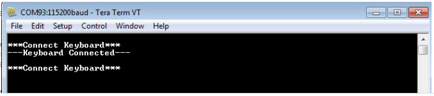

# HID Basic Keyboard Example (hid_basic_keyboard)

This application demonstrates the ability of the MPLAB Harmony USB Host HID Client Driver to support to enumerate and operate a HID keyboard device. 

## Description

This application creates a USB Host application that uses the USB Host Layer, HID Client driver and HID Keyboard Usage driver to enumerate a USB keyboard and understand keyboard press release events. The keyboard events are displayed using a terminal emulator on a personal computer.

##  Downloading and building the application

To clone or download this application from Github, go to the [main page of this repository](https://github.com/Microchip-MPLAB-Harmony/usb_apps_host) and then click **Clone** button to clone this repository or download as zip file.
This content can also be downloaded using content manager by following these [instructions](https://github.com/Microchip-MPLAB-Harmony/contentmanager/wiki).

Path of the application within the repository is [usb_apps_host/apps/hid_basic_keyboard](https://github.com/Microchip-MPLAB-Harmony/usb_apps_host/tree/master/apps/hid_basic_keyboard).

Following table gives the details of project configurations, target device used, hardware and its IDE. Open the project using the respective IDE and build it. 

| Project Name                    | IDE    | Target Device       | Hardware / Configuration                                                   |
| ------------------------------- | ------ | ------------------- | -------------------------------------------------------------------------- |
| pic32cm_le00_curiosity_pro.X    | MPLABX | PIC32CM5164LE00100  | [PIC32CM Lx Curiosity Pro Board](#config_22)               |
| pic32mz_ef_curiosity_2_0.X      | MPLABX | PIC32MZ2048EFM144   | [Curiosity PIC32MZ EF 2.0 Development Board](#config_15)   |
| sam_9x60_ek.X                   | MPLABX | SAM9X60             | [SAM9X60-EK Evaluation Board](#config_9)                   |
| sam_9x60_ek_freertos.X          | MPLABX | SAM9X60             | [SAM9X60-EK Evaluation Board](#config_9)                   |
| sam_a5d2_xult.X                 | MPLABX | ATSAMA5D27C         | [SAMA5D2 Xplained Ultra Board](#config_10)                 |
| sam_a5d2_xult_freertos.X        | MPLABX | ATSAMA5D27C         | [SAMA5D2 Xplained Ultra Board](#config_10)                 |
| sam_a5d27_som1_ek.X             | MPLABX | ATSAMA5D27C         | [SAMA5D27 SOM1 Kit1](#config_18)                           |
| sam_a5d27_som1_ek_freertos.X    | MPLABX | ATSAMA5D27C         | [SAMA5D27 SOM1 Kit1](#config_18)                           |
| sam_a5d27_wlsom1_ek1.X          | MPLABX | ATSAMA5D27C         | [ATSAMA5D27 WLSOM1 EK1](#config_19)                        |
| sam_a5d27_wlsom1_ek1_freertos.X | MPLABX | ATSAMA5D27C         | [ATSAMA5D27 WLSOM1 EK1](#config_19)                        |
| sam_a7g5_ek.X                   | MPLABX | SAMA7G54            | [SAMA7G5 EK Board](#config_21)                             |
| sam_d21_xpro.X                  | MPLABX | ATSAMD21J18A        | [SAMD21 Xplained Pro Board](#config_2)                     |
| sam_e54_xpro.X                  | MPLABX | ATSAME54P20A        | [SAME54 Xplained Pro Board](#config_3)                     |
| sam_e70_xult.X                  | MPLABX | ATSAME70Q21B        | [SAME70 Xplained Ultra Board](#config_4)                   |
| sam_e70_xult_freertos.X         | MPLABX | ATSAME70Q21B        | [SAME70 Xplained Ultra Board](#config_4)                   |
| sam_g55_xpro.X                  | MPLABX | ATSAMG55J19         | [SAMG55 Xplained Pro Board](#config_6)                     |
| sam_g55_xpro_freertos.X         | MPLABX | ATSAMG55J19         | [SAMG55 Xplained Pro Board](#config_6)                     |
| pic32cz_ca80_curiosity_ultra.X  | MPLABX | PIC32CZ8110CA80208  | [PIC32CZ Curiosity Development Board](#config_23)          |

##  Configuring the Hardware

###  PIC32CZ CA80 Curiosity Development Board
- A commercially available USB Keyboard is required to run this demonstration application. 
- Connect the USB Keyboard to the connector (J102) using a USB Type-A Female to micro-B male cable  (This cable is not included in the kit). 
- The demonstration uses the PKOB4 Serial Interface to transfer messages on a PC. 
- LED0 indicates a Device Connection. (Attached device has been successfully enumerated and configured). The LED on the keyboard is also toggled on Keyboard "CapsLock" press event.

###  [SAMD21 Xplained Pro Board](https://www.microchip.com/developmenttools/ProductDetails/atsamd21-xpro)

- A commercially available USB Keyboard is required to run this demonstration application. 
- Jumper titled "PA03 SELECT" must be shorted between PA03 and USB_ID (positions 2 and 3)
- Use "TARGET USB" connector on the board to connect the USB Keyboard to the USB Host. A USB Type-A Female to micro-B male cable will be needed to connect the device (This cable is not included in the kit). 
- The demonstration uses the EDBG Serial Interface to transfer demonstration application messages on a PC. 
- LED0 indicates a Device Connection. (Attached device has been successfully enumerated and configured). The LED on the keyboard is also toggled on Keyboard "CapsLock" press event.

###  [SAME54 Xplained Pro Board](https://www.microchip.com/developmenttools/productdetails/atsame54-xpro)

- A commercially available USB Keyboard is required to run this demonstration application. 
- Use "TARGET USB" connector on the board to connect the USB Keyboard to the USB Host. A USB Type-A Female to micro-B male cable will be needed to connect the device (This cable is not included in the kit). 
- The demonstration uses the EDBG Serial Interface to transfer demonstration application messages on a PC. 
- LED0 indicates a Device Connection. (Attached device has been successfully enumerated and configured). The LED on the keyboard is also toggled on Keyboard "CapsLock" press event.

###  [SAME70 Xplained Ultra Board](https://www.microchip.com/DevelopmentTools/ProductDetails/PartNO/DM320113)

- A commercially available USB Keyboard is required to run this demonstration application. 
- Jumper J203 must be shorted between PB08 and LED2 (positions 1 and 2).
- Use "TARGET USB" J200 connector on the board to connect the USB Keyboard to the USB Host. A USB Type-A Female to micro-B male cable will be needed to connect the device (This cable is not included in the kit). 
- The demonstration uses the EDBG Serial Interface to transfer demonstration application messages on a PC. 
- LED3 indicates a Device Connection. (Attached device has been successfully enumerated and configured). The LED on the keyboard is also toggled on Keyboard "CapsLock" press event.

###  [SAMG55 Xplained Pro Board](https://www.microchip.com/DevelopmentTools/ProductDetails/PartNO/ATSAMG55-XPRO)

- A commercially available USB Keyboard is required to run this demonstration application.
- Chip Erase Jumper must be open.
- Use TARGET USB connector on the board to connect the USB keyboard to the USB Host. A USB Type-A Female to micro-B male cable will be needed to connect the device (This cable is not included in the kit). 
- The demonstration uses the EDBG Serial Interface to transfer demonstration application messages on a PC. 
- LED0 indicates a Device Connection. (Attached device has been successfully enumerated and configured). The LED on the keyboard is also toggled on Keyboard "CapsLock" press event.

###  [SAM9X60-EK Evaluation Board](https://www.microchip.com/developmenttools/ProductDetails/DT100126)

- A commercially available USB Keyboard is required to run this demonstration application.
- Setup the SD card 
    - Download harmony MPU bootstrap loader from this [location](firmware/at91bootstrap_sam_9x60_ek.X/build/binaries/boot.bin).
    - Copy the downloaded boot loader binary (boot.bin) and generated application binary (harmony.bin) into the SD card.
    - Insert the SD card into the SDMMC connector J4 on the board.
    - Reset the board by pressing the Push Button SW3. 
- Jumpers J20, J21, and J13 must be open.
- Jumper J2 and J3 must be shorted.
- Connect the USB Micro-B port (J22) on board to the computer using a micro USB cable (to enable debug com port).
- Connect the USB Micro-B Connector (J7) on the board to the computer using a micro USB cable to power up the board. 
- Connect the USB device to the Type-A connector (J8).
- LED D1 indicates a Device Connection (Attached device has been successfully enumerated and configured). The LED on the keyboard is also toggled on Keyboard "CapsLock" press event.

    

    **Note: Reset push button on SAM9X60 EK is labeled as SW3**

###  [SAMA5D2 Xplained Ultra Board](https://www.microchip.com/Developmenttools/ProductDetails/ATSAMA5D2C-XULT)

- A commercially available USB Keyboard is required to run this demonstration application.
- Setup the SD card 
    - Download harmony MPU bootstrap loader from this [location](firmware/at91bootstrap_sam_a5d2_xult.X/build/binaries/boot.bin).
    - Copy the downloaded boot loader binary (boot.bin) and generated application binary (harmony.bin) into the SD card.
    - Insert the SD card into the SDMMC1 slot on the board.
    - Reset the board by pressing the Push Button BP3. 
- Connect the EDBG USB Micro-B port J14 on the board to the computer using a micro USB cable.
- Connect the USB device to the USB Type-A connector "A5-USB-B" (J13).   
- The demonstration uses the EDBG USB Micro-B port J14 to transfer demonstration application messages on a PC. 
- RGB LED indicates a Device Connection (Attached device has been successfully enumerated and configured). The LED on the keyboard is also toggled on Keyboard "CapsLock" press event.

###  [Curiosity PIC32MZ EF 2.0 Development Board](https://www.microchip.com/Developmenttools/ProductDetails/DM320209)

- A commercially available USB Keyboard is required to run this demonstration application. 
- Connect the USB Keyboard to the "TARGET USB" connector (J201) using a USB Type-A Female to micro-B male cable  (This cable is not included in the kit). 
- The demonstration uses the PKOB4 Serial Interface to transfer messages on a PC. 
- LED1 indicates a Device Connection (Attached device has been successfully enumerated and configured). This LED is also toggled on the Keyboard "CapsLock" Button press event.

###  [SAMA5D27 SOM1 Kit1](https://www.microchip.com/developmenttools/ProductDetails/atsama5d27-som1-ek1)

- A commercially available USB Keyboard is required to run this demonstration application.
- Setup the SD card
    - Jumper J9 must be removed to have the JTAG-CDC enable.
    - Download harmony MPU bootstrap loader from this [location](firmware/at91bootstrap_sam_a5d27_som1_ek.X/build/binaries/boot.bin).
    - Copy the downloaded boot loader binary (boot.bin) and generated application binary (harmony.bin) into the SD card.
    - Insert the SD card into the SDMMC0 slot (J12) on the board.
    - Reset the board by pressing the Push Button PB1. 
- Connect the USB Micro-AB port (J10) on the board to the computer using a micro USB cable.
- Connect the USB device to the USB-B Type-C connector (J19) on the board. 
- The demonstration uses the USB Micro-AB port (J10) to transfer demonstration application messages on a PC. 
- RGB LED indicates a Device Connection (Attached device has been successfully enumerated and configured). The LED on the keyboard is also toggled on Keyboard "CapsLock" press event. 

  

###  [ATSAMA5D27-WLSOM1 Evaluation Kit ](https://www.microchip.com/DevelopmentTools/ProductDetails/PartNO/DM320117)

- A commercially available USB Keyboard is required to run this demonstration application.
- Setup the SD card 
    - Download harmony MPU bootstrap loader from this [location](firmware/at91bootstrap_sam_a5d27_wlsom1_ek1.X/build/binaries/boot.bin).
    - Copy the downloaded boot loader binary (boot.bin) and generated application binary (harmony.bin) into the SD card.
    - Insert the SD card into the SDMMC0 Card Connector (J9) on the board.
    - Reset the board by pressing the Reset Button (SW2) 
- Connect the USB-A Micro-AB connector (J10) on the board to the computer using a micro USB cable.
- Press the "START_SOM" button to activate board start-up.  
- Connect the USB device to the USB Type-A connector (J11) on the board. 
- The demonstration uses the Debug UART port (J26) to transfer demonstration application messages on a PC. A USB/Serial converter is required to connect the J26 to a PC (The USB/Serial converter is not included in the kit). 
- RGB LED indicates a Device Connection (Attached device has been successfully enumerated and configured). The LED on the keyboard is also toggled on Keyboard "CapsLock" press event. 
  

###  [SAMA7G5-EK Evaluation Kit](https://www.microchip.com/en-us/development-tool/EV21H18A)

- A commercially available USB Keyboard is required to run this demonstration application.
- Powered the board with an external power supply (J1).
- Setup the SD card 
    - Download harmony MPU bootstrap loader from this [location](firmware/at91bootstrap_sam_a7g5_ek.X/build/binaries/boot.bin).
    - Copy the downloaded boot loader binary (boot.bin) and generated application binary (harmony.bin) into the SD card.
    - Insert the SD card into the SD Card Connector (J4) on the board.
    - Reset the board by pressing the Reset Button (nRST) 
- Press the "nSTART" button to activate board start-up.
- Connect the USB device to the USB Host Type-A connector (J9) on the board. 
  Alternatively, the USB Device could be connected to the Type-C connector (J8) or micro A/B connector (J7). 
- The demonstration uses the Debug UART port (J24) to transfer demonstration application messages on a PC. 
- RGB LED indicates a Device Connection (Attached device has been successfully enumerated and configured). The LED on the keyboard is also toggled on Keyboard "CapsLock" press event. 

###  [Curiosity Pro PIC32CM LE00 Development Board](https://www.microchip.com/en-us/development-tool/EV80P12A)

- Powered the board by connecting an host to "DEBUG USB" (J300) connector.
- Connect the USB device to the USB Host "TARGET USB" (J200) using a USB Type-A Female to micro-B male cable (This cable is not included in the kit).
- LED0 indicates a Device Connection (Attached device has been successfully enumerated and configured). This LED is also toggled on the Keyboard "CapsLock" Button press event.

## Running the Application

1. Open the project with appropriate IDE. Compile the project and program the target device.
1. Connect the serial interface on the board to a PC. On the PC, launch a terminal emulator, such as Tera Term, and select the appropriate COM port and set the serial port settings to 115200-N-1. 
1. If a USB keyboard is not connected to the Embedded USB Host, the terminal emulator window will show the Connect Keyboard prompt. 
1. Attach a USB keyboard to the Host connector of the target hardware. The message, Keyboard Connected, will appear in the terminal emulator window. Refer to the [Configuring the Hardware](#config_title) section for any converter requirements. 
1. Begin typing on the keyboard and the appropriate keys should be displayed on the serial terminal. Subsequent press and release of modifier keys (i.e., CAPS LOCK, NUM LOCK, etc.) will result in the appropriate keyboard LEDs to turning ON and OFF. 
1. Disconnecting the keyboard will result in the message, Connect Keyboard.

    
