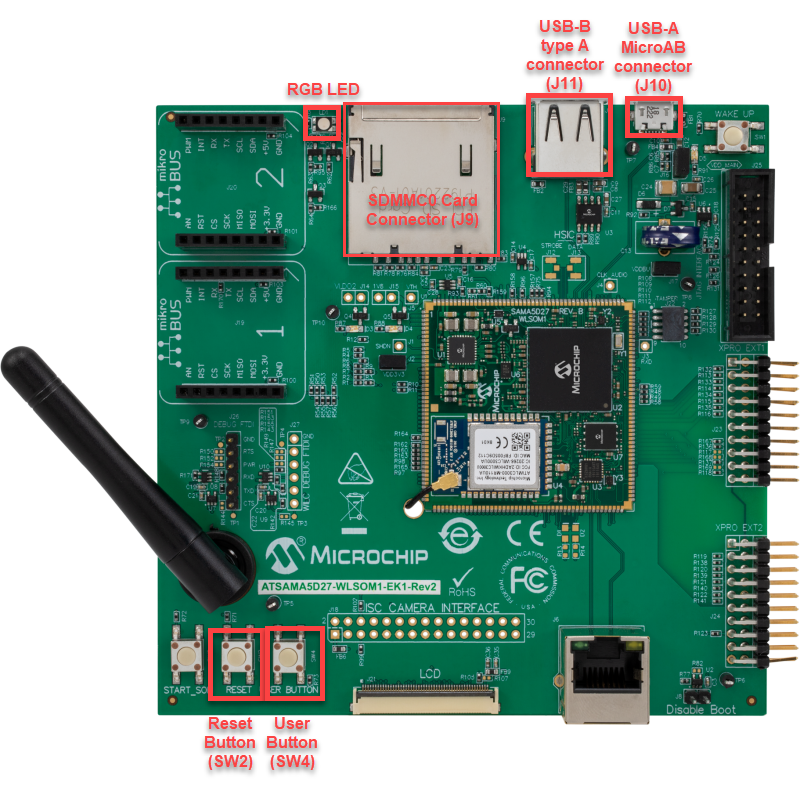

# HUB MSD Example (hub_msd)

This application demonstrates the ability of the MPLAB Harmony USB Host Stack to interact with more than one USB Mass Storage Device through a Hub. 

## Description

This application uses USB Host stack and the Harmony Filesystem Service to copy a file from a source USB pen drive to a target USB pen drive.

##  Downloading and building the application

To clone or download this application from Github, go to the [main page of this repository](https://github.com/Microchip-MPLAB-Harmony/usb_apps_host) and then click **Clone** button to clone this repository or download as zip file.
This content can also be downloaded using content manager by following these [instructions](https://github.com/Microchip-MPLAB-Harmony/contentmanager/wiki).

Path of the application within the repository is [usb_apps_host/apps/hub_msd](https://github.com/Microchip-MPLAB-Harmony/usb_apps_host/tree/master/apps/hub_msd).

Following table gives the details of project configurations, target device used, hardware and its IDE. Open the project using the respective IDE and build it. 

| Project Name                    | IDE    | Target Device       | Hardware / Configuration                                                   |
| ------------------------------- | ------ | ------------------- | -------------------------------------------------------------------------- |
| pic32mz_ef_curiosity_2_0.X      | MPLABX | PIC32MZ2048EFM144   | [Curiosity PIC32MZ EF 2.0 Development Board](#config_15)                   |
| pic32mx470_curiosity.X          | MPLABX | PIC32MX470F512H     | [PIC32MX Curiosity Development Board](#config_13)                          |
| pic32mz_ef_sk.X                 | MPLABX | PIC32MZ2048EFH144   | [PIC32MZ Embedded Connectivity with FPU (EF) Starter Kit](#config_16)      |
| sam_9x60_ek.X                   | MPLABX | SAM9X60             | [SAM9X60-EK Evaluation Board](#config_9)                                   |
| sam_9x60_curiosity.X            | MPLABX | SAM9X60             | [SAM9X60 Curiosity Development Board](#config_sam9x60_curiosity) |
| sam_9x60_curiosity_freertos.X   | MPLABX | SAM9X60             | [SAM9X60 Curiosity Development Board](#config_sam9x60_curiosity) |
| sam_a5d2_xult.X           | MPLABX    | ATSAMA5D27C         | [SAMA5D2 Xplained Ultra Board](#config_10)                                |
| sam_a5d27_som1_ek.X           | MPLABX    | ATSAMA5D27C         | [SAMA5D27 SOM1 Kit1](#config_18)                                |
| sam_a5d27_wlsom1_ek1.X           | MPLABX    | ATSAMA5D27C         | [ATSAMA5D27 WLSOM1 EK1](#config_19)                                |
| sam_a7g5_ek.X                   | MPLABX | SAMA7G54            | [SAMA7G5 EK Board](#config_21)                                    |
| sam_d21_xpro.X                  | MPLABX | ATSAMD21J18A        | [SAMD21 Xplained Pro Board](#config_2)                                    |
| sam_e54_xpro.X                  | MPLABX | ATSAME54P20A        | [SAME54 Xplained Pro Board](#config_3)                                    |
| sam_g55_xpro.X                  | MPLABX | ATSAMG55J19         | [SAMG55 Xplained Pro Board](#config_6)                                    |
| pic32cz_ca80_curiosity_ultra.X  | MPLABX | PIC32CZ8110CA80208  | [PIC32CZ Curiosity Development Board](#config_23)           |
| pic32ck_gc01_curiosity_ultra.X  | MPLABX | PIC32CK2051GC01144  | [PIC32CK Curiosity Development Board](#config_24)           |

##  Configuring the Hardware

###  PIC32CZ CA80 Curiosity Development Board
- An external power supply (6.5V to 14V) must be connected through the J100 connector. 
- Connect the USB Hub to the micro A/B connector (J102) using a USB Type-A Female to micro-B male cable (This cable is not included in the kit). 
- LED0 on the demonstration board will illuminate to indicate completion of the file transfer.

###  PIC32CK  Curiosity Development Board
- An external power supply (6.5V to 14V) must be connected through the J200 connector. 
- Connect the USB Hub to the micro C connector (J202). A USB Type-C to Type-A Female adapter is required to connect the USB device to the board. (This adapter is not included in the kit).  
- LED1 on the demonstration board will illuminate to indicate completion of the file transfer.

###  [Curiosity PIC32MZ EF 2.0 Development Board](https://www.microchip.com/Developmenttools/ProductDetails/DM320209)

- Connect the USB Hub to the "TARGET USB" connector (J201) using a USB Type-A Female to micro-B male cable  (This cable is not included in the kit). 
- LED1 on the demonstration board will illuminate to indicate completion of the file transfer. 

###  [Curiosity PIC32MX470 Development Board](https://www.microchip.com/Developmenttools/ProductDetails/dm320103)

- Install a jumper in the J13 header to drive the VBUS line in Host mode.
- Connect the USB Hub to the USB micro-AB connector J12 using a USB Type-A Female to micro-B male cable  (This cable is not included in the kit). 
- LED1 on the demonstration board will illuminate to indicate completion of the file transfer.

###  [PIC32MZ Embedded Connectivity with FPU (EF) Starter Kit](https://www.microchip.com/Developmenttools/ProductDetails/DM320007)

- Connect the USB Hub to the Type-A connector J5, which is located on the top side of the starter kit. 
- LED1 on the demonstration board will illuminate to indicate completion of the file transfer. 

###  [SAMD21 Xplained Pro Board](https://www.microchip.com/developmenttools/ProductDetails/atsamd21-xpro)

- Connect the Debug USB port on the board to the computer using a micro USB cable 
- Jumper titled "PA03 SELECT" must be shorted between PA03 and USB_ID(positions 2 and 3) 
- Use "TARGET USB" connector on the board to connect the USB Device to the the USB Host. A USB micro AB to type A USB Host receptacle converter will be needed to connect the device. 
- LED0 on the demonstration board will illuminate to indicate completion of the file transfer. 

###  [SAME54 Xplained Pro Board](https://www.microchip.com/developmenttools/productdetails/atsame54-xpro)

- Connect the Debug USB port on the board to the computer using a micro USB cable 
- Use "TARGET USB" connector on the board to connect the USB Device to the the USB Host. A USB micro AB to type A USB Host receptacle converter will be needed to connect the device. 
- LED0 on the demonstration board will illuminate to indicate completion of the file transfer. 

###  [SAMG55 Xplained Pro Board](https://www.microchip.com/DevelopmentTools/ProductDetails/PartNO/ATSAMG55-XPRO)

- Chip Erase Jumper must be open.
- Connect the USB device to the "TARGET USB" connector using a USB Type-A Female to micro-B male cable  (This cable is not included in the kit).
- LED0 on the demonstration board will illuminate to indicate completion of the file transfer.

###  [SAM9X60-EK Evaluation Board](https://www.microchip.com/developmenttools/ProductDetails/DT100126)

- Setup the SD card 
    - Download harmony MPU bootstrap loader from this [location](firmware/at91bootstrap_sam_9x60_ek.X/build/binaries/boot.bin).
    - Copy the downloaded boot loader binary (boot.bin) and generated application binary (harmony.bin) into the SD card.
    - Insert the SD card into the SDMMC connector J4 on the board.
    - Reset the board by pressing the Push Button SW3. 
- Jumpers J20, J21, and J13 must be open.
- Jumper J2 and J3 must be shorted.
- Connect the USB Micro-B port J22 on board to the computer using a micro USB cable (to enable debug com port).
- Connect the USB Micro-B Connector (J7) on the board to the computer using a micro USB cable to power up the board. 
- Connect the USB Hub to the Type-A connector (J8).
- LED D1 indicates that the file transfer is complete. 

    

    **Note: Reset push button on SAM9X60 EK is labeled as SW3**

###  [SAM9X60-Curiosity Board](https://www.microchip.com/en-us/development-tool/EV40E67A)
- Setup the SD card 
    - Download harmony MPU bootstrap loader from this [location](firmware/at91bootstrap_sam_9x60_curiosity.X/build/binaries/boot.bin).
    - Copy the downloaded boot loader binary (boot.bin) and generated application binary (harmony.bin) into the SD card.
    - Insert the SD card into the SDMMC0 connector J3 on the board.
    - Reset the board by pressing the Push Button RESET. 
- Jumper J4 must be shorted.
- Connect the USB Micro-B Connector (J1) on the board to the computer using a micro USB cable to power up the board.
- Connect the USB Hub to the Type-A connector (J10).
- LED D1 indicates that the file transfer is complete. 

    

###  [SAMA5D2 Xplained Ultra Board](https://www.microchip.com/Developmenttools/ProductDetails/ATSAMA5D2C-XULT)

- Setup the SD card 
    - Download harmony MPU bootstrap loader from this [location](firmware/at91bootstrap_sam_a5d2_xult.X/build/binaries/boot.bin).
    - Copy the downloaded boot loader binary (boot.bin) and generated application binary (harmony.bin) into the SD card.
    - Insert the SD card into the SDMMC1 slot on the board.
    - Reset the board by pressing the Push Button BP3. 
- Connect the EDBG USB Micro-B port J14 on the board to the computer using a micro USB cable.
- Connect the USB Hub to the USB Type-A connector "A5-USB-B" (J13).  
- RGB LED turning to Green indicates the file write is complete.

###  [SAMA5D27 SOM1 Kit1](https://www.microchip.com/developmenttools/ProductDetails/atsama5d27-som1-ek1)

- Setup the SD card 
    - Download harmony MPU bootstrap loader from this [location](firmware/at91bootstrap_sam_a5d27_som1_ek.X/build/binaries/boot.bin).
    - Copy the downloaded boot loader binary (boot.bin) and generated application binary (harmony.bin) into the SD card.
    - Insert the SD card into the SDMMC0 slot (J12) on the board.
    - Reset the board by pressing the Push Button PB1. 
- Connect the Debug USB port (J10) on the board to the computer using a micro USB cable.
- Connect the USB Hub to the USB-B Type-C connector (J19) on the board. 
- RGB LED turning to Green indicates the file write is complete.
  

###  [ATSAMA5D27-WLSOM1 Evaluation Kit ](https://www.microchip.com/DevelopmentTools/ProductDetails/PartNO/DM320117)

- Setup the SD card 
    - Download harmony MPU bootstrap loader from this [location](firmware/at91bootstrap_sam_a5d27_wlsom1_ek1.X/build/binaries/boot.bin).
    - Copy the downloaded boot loader binary (boot.bin) and generated application binary (harmony.bin) into the SD card.
    - Insert the SD card into the SDMMC0 Card Connector (J9) on the board.
    - Reset the board by pressing the Reset Button (SW2) 
- Connect the USB-A MicroAB connector (J10) on the board to the computer using a micro USB cable.
- Press the "START_SOM" button to activate board start-up.  
- Connect the USB Hub to the USB Type-A connector (J11) on the board. 
- RGB LED turning to Green indicates the file write is complete.
  

###  [SAMA7G5-EK Evaluation Kit](https://www.microchip.com/en-us/development-tool/EV21H18A)

- Powered the board with an external power supply (J1).
- Setup the SD card 
    - Download harmony MPU bootstrap loader from this [location](firmware/at91bootstrap_sam_a7g5_ek.X/build/binaries/boot.bin).
    - Copy the downloaded boot loader binary (boot.bin) and generated application binary (harmony.bin) into the SD card.
    - Insert the SD card into the SD Card Connector (J4) on the board.
    - Reset the board by pressing the Reset Button (nRST) 
- Press the "nSTART" button to activate board start-up.  
- Connect the USB device to the USB Host Type-A connector (J9) on the board. 
  Alternatively, the USB Device could be connected to the Type-C connector (J8) or micro A/B connector (J7). 
- RGB LED turning to Green indicates the file write is complete.

## Running the Application

This application demonstrates the capability of the USB Host Stack to access and manage multiple USB Devices through a Hub. The demonstration application copies a file from one USB pen drive (i.e.,a USB Flash storage device) to another USB pen drive, where these pen drives are attached to a hub. 

1. Open the project in the MPLAB X IDE. Refer to [Building the Application](#building_the_application) section for available demo projects. 
1. Build the code and program the device. 
1. Connect a hub to the Host connector on the desired board. 
1. Connect a USB Pen drive containing an arbitrary file named "file.txt" to a spare port on the hub. 
1. Connect another USB pen drive to another spare port on the hub. 
1. The application will copy the file "file.txt" from the drive containing this file to the other drive. The copied file will be renamed as "newfile.txt". LED on the demonstration board will illuminate to indicate completion of the file transfer. 
1. Disconnect the drives and confirm demonstration success by inserting them into a personal computer and verifying the file transfer completed as expected. 
1. The demonstration application will always be in state where it waits for two pen drives to be connected to the hub and at least one of these pen drives contains a file named "file.txt".

