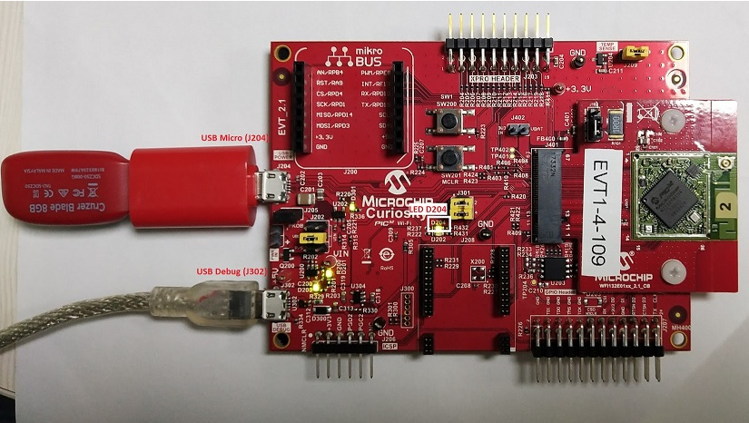

# MSD Basic Example (msd_basic)

This application demonstrates the ability of the MPLAB Harmony USB Host Stack to support MSD Host Class Driver . It demonstrates the feature with an application to read / write a file to a USB Flash drive.

## Description

This application demonstrates the use of the MSD Host Class Driver to write a file to a USB Flash drive. The application uses the USB Host_layer , MSD class driver and the MPLAB Harmony File System Framework to enumerate a USB Flash drive and to write a file to it.

## Downloading and building the application

To clone or download this application from Github, go to the [main page of this repository](https://github.com/Microchip-MPLAB-Harmony/usb_apps_host) and then click **Clone** button to clone this repository or download as zip file.
This content can also be downloaded using content manager by following these [instructions](https://github.com/Microchip-MPLAB-Harmony/contentmanager/wiki).

Path of the application within the repository is [usb_apps_host/apps/msd_basic](https://github.com/Microchip-MPLAB-Harmony/usb_apps_host/tree/master/apps/msd_basic).

Following table gives the details of project configurations, target device used, hardware and its IDE. Open the project using the respective IDE and build it. 

| Project Name                    | IDE    | Target Device       | Hardware / Configuration                                                   |
| ------------------------------- | ------ | ------------------- | -------------------------------------------------------------------------- |
| pic32mk_gp_db.X                 | MPLABX | PIC32MK1024GPE100   | [PIC32MK General Purpose (GP) Development Board](#config_12)               |
| pic32mk_gp_db_freertos.X        | MPLABX | PIC32MK1024GPE100   | [PIC32MK General Purpose (GP) Development Board](#config_12)               |
| pic32mx470_curiosity.X          | MPLABX | PIC32MX470F512H     | [PIC32MX Curiosity Development Board](#config_13)                          |
| pic32mx470_curiosity_freertos.X | MPLABX | PIC32MX470F512H     | [PIC32MX Curiosity Development Board](#config_13)                          |
| pic32mz_das_sk.X                | MPLABX | PIC32MZ2064DAS169   | [PIC32MZ Embedded Graphics with Stacked DRAM (DA) Starter Kit](#config_14) |
| pic32mz_ef_curiosity_2.X        | MPLABX | PIC32MZ2048EFM144   | [Curiosity PIC32MZ EF 2.0 Development Board](#config_15)                   |
| pic32mz_ef_sk.X                 | MPLABX | PIC32MZ2048EFH144   | [PIC32MZ Embedded Connectivity with FPU (EF) Starter Kit](#config_16)      |
| pic32mz_ef_sk_freertos.X        | MPLABX | PIC32MZ2048EFH144   | [PIC32MZ Embedded Connectivity with FPU (EF) Starter Kit](#config_16)      |
| pic32mz_w1_curiosity.X          | MPLABX | PIC32MZ1025W104132  | [Curiosity PIC32MZ W1 Development Board](#config_17)                       |
| sam_9x60_ek.X                   | MPLABX | SAM9X60             | [SAM9X60-EK Evaluation Board](#config_9)                                   |
| sam_9x60_ek_freertos.X                   | MPLABX | SAM9X60             | [SAM9X60-EK Evaluation Board](#config_9)                                   |
| sam_9x60_ek_iar.IAR             | IAR    | SAM9X60             | [SAM9X60-EK Evaluation Board](#config_9)                                   |
| sam_9x60_ek_freertos_iar.IAR    | IAR    | SAM9X60             | [SAM9X60-EK Evaluation Board](#config_9)                                   |
| sam_a5d2_xult.X           | MPLABX    | ATSAMA5D27C         | [SAMA5D2 Xplained Ultra Board](#config_10)                                |
| sam_a5d2_xult_freertos.X           | MPLABX   | ATSAMA5D27C         | [SAMA5D2 Xplained Ultra Board](#config_10)                                |
| sam_a5d2_xult_iar.IAR           | IAR    | ATSAMA5D27C         | [SAMA5D2 Xplained Ultra Board](#config_10)                                |
| sam_a5d2_xult_freertos_iar.IAR  | IAR    | ATSAMA5D27C         | [SAMA5D2 Xplained Ultra Board](#config_10)                                |
| sam_a5d27_som1_ek.X           | MPLABX    | ATSAMA5D27C         | [SAMA5D27 SOM1 Kit1](#config_18)                                |
| sam_a5d27_som1_ek_freertos.X           | MPLABX   | ATSAMA5D27C         | [SAMA5D27 SOM1 Kit1](#config_18)                                |
| sam_a5d27_wlsom1_ek1.X           | MPLABX    | ATSAMA5D27C         | [ATSAMA5D27 WLSOM1 EK1](#config_19)                                |
| sam_a5d27_wlsom1_ek1_freertos.X           | MPLABX   | ATSAMA5D27C         | [ATSAMA5D27 WLSOM1 EK1](#config_19)                                |
| sam_a7g5_ek.X                   | MPLABX | SAMA7G54            | [SAMA7G5 EK Board](#config_21)                                    |
| sam_d21_xpro.X                  | MPLABX | ATSAMD21J18A        | [SAMD21 Xplained Pro Board](#config_2)                                    |
| sam_d21_xpro_iar.IAR            | IAR    | ATSAMD21J18A        | [SAMD21 Xplained Pro Board](#config_2)                                    |
| sam_e54_xpro.X                  | MPLABX | ATSAME54P20A        | [SAME54 Xplained Pro Board](#config_3)                                    |
| sam_e54_xpro_iar.IAR            | IAR    | ATSAME54P20A        | [SAME54 Xplained Pro Board](#config_3)                                    |
| sam_e70_xult.X                  | MPLABX | ATSAME70Q21B        | [SAME70 Xplained Ultra Board](#config_4)                                  |
| sam_e70_xult_freertos.X         | MPLABX | ATSAME70Q21B        | [SAME70 Xplained Ultra Board](#config_4)                                  |
| sam_e70_xult_iar.IAR            | IAR    | ATSAME70Q21B        | [SAME70 Xplained Ultra Board](#config_4)                                  |
| sam_g55_xpro.X                  | MPLABX | ATSAMG55J19         | [SAMG55 Xplained Pro Board](#config_6)                                    |
| sam_g55_xpro_freertos.X         | MPLABX | ATSAMG55J19         | [SAMG55 Xplained Pro Board](#config_6)                                    |
| sam_l21_xpro.X                  | MPLABX | ATSAML21J18B        | [SAML21 Xplained Pro Board](#config_7)                                    |
| sam_v71_xult_freertos.X         | MPLABX | ATSAMV71Q21B        | [SAMV71 Xplained Ultra board](#config_5)                                    |

##  Configuring the Hardware

###  [Curiosity PIC32MZ EF 2.0 Development Board](https://www.microchip.com/Developmenttools/ProductDetails/DM320209)

- Connect the USB device to the "TARGET USB" connector (J201) using a USB Type-A Female to micro-B male cable  (This cable is not included in the kit). 
- LED1 indicates the file write is complete.

###  [Curiosity PIC32MX470 Development Board](https://www.microchip.com/Developmenttools/ProductDetails/dm320103)

- Install a jumper in the J13 header to drive the VBUS line in Host mode.
- Connect the USB device to the USB micro-AB connector J12 using a USB Type-A Female to micro-B male cable  (This cable is not included in the kit). 
- LED1 indicates the file write is complete.

###  [PIC32MZ Embedded Connectivity with FPU (EF) Starter Kit](https://www.microchip.com/Developmenttools/ProductDetails/DM320007)

- Connect the USB device to the Type-A connector J5, which is located on the top side of the starter kit.
- LED1 indicates the file write is complete.

###  [PIC32MK General Purpose (GP) Development Board](https://www.microchip.com/developmenttools/ProductDetails/dm320106)

- Connect the USB device to the Type-A connector J5, which is located on the top side of the starter kit.
- LED1 indicates the file write is complete.

###  [PIC32MZ Embedded Graphics with Stacked DRAM (DA) Starter Kit](https://www.microchip.com/DevelopmentTools/ProductDetails/DM320010-C)

- Connect the USB device to the Type-A connector J7, which is located on the top side of the starter kit.
- LED1 indicates the file write is complete.

###  [SAM D21 Xplained Pro Board](https://www.microchip.com/developmenttools/ProductDetails/atsamd21-xpro)
- The jumper titled "PA03 SELECT" must be shorted between PA03 and USB_ID (positions 2 and 3).
- Connect the USB device to the "TARGET USB" connector using a USB Type-A Female to micro-B male cable  (This cable is not included in the kit). 
- LED0 indicates the file write is complete.

###  [SAM E54 Xplained Pro Board](https://www.microchip.com/developmenttools/productdetails/atsame54-xpro)

- Connect the USB device to the "TARGET USB" connector using a USB Type-A Female to micro-B male cable  (This cable is not included in the kit).
- LED0 indicates the file write is complete.

###  [SAM E70 Xplained Ultra Board](https://www.microchip.com/DevelopmentTools/ProductDetails/PartNO/DM320113)

- Jumper J203 must be shorted between PB08 and LED2 (positions 1 and 2).
- Connect the USB device to the "TARGET USB" connector (J200) using a USB Type-A Female to micro-B male cable  (This cable is not included in the kit).
- LED3 indicates the file write is complete.

###  [SAMG55 Xplained Pro Board](https://www.microchip.com/DevelopmentTools/ProductDetails/PartNO/ATSAMG55-XPRO)

- Chip Erase Jumper must be open.
- Connect the USB device to the "TARGET USB" connector using a USB Type-A Female to micro-B male cable  (This cable is not included in the kit).
- LED0 indicates the file write is complete.

###  [SAML21 Xplained Pro Board](https://www.microchip.com/developmenttools/ProductDetails/PartNO/ATSAML21-XPRO-B)

- Connect the USB device to the "TARGET USB" connector using a USB Type-A Female to micro-B male cable  (This cable is not included in the kit).
- LED0 indicates the file write is complete.

###  [SAMV71 Xplained Ultra Board](https://www.microchip.com/developmenttools/ProductDetails/atsamv71-xult)

- Jumper titled "USB VBUS" must be shorted between PC09 and LED1 (positions 1 and 2) 
- Connect the USB device to the "TARGET USB" connector using a USB Type-A Female to micro-B male cable  (This cable is not included in the kit).
- LED0 indicates the file write is complete. 

###  [Curiosity PIC32MZ W1 Development Board](https://www.microchip.com/DevelopmentTools/ProductDetails/PartNO/DM320104)

- Jumper J205 must be shorted.
- Connect the USB device to the "TARGET USB" connector using a USB Type-A Female to micro-B male cable  (This cable is not included in the kit).
- The LED D204 indicates the file write is complete.

    

###  [SAM9X60-EK Evaluation Board](https://www.microchip.com/developmenttools/ProductDetails/DT100126)

- Setup the SD card 
    - Download harmony MPU bootstrap loader from this [location](firmware/at91bootstrap_sam_9x60_ek.X/binaries/boot.bin).
    - Copy the downloaded boot loader binary (boot.bin) and generated application binary (harmony.bin) into the SD card.
    - Insert the SD card into the SDMMC connector J4 on the board.
    - Reset the board by pressing the Push Button SW3. 
- Jumpers J20, J21, and J13 must be open.
- Jumper J2 and J3 must be shorted.
- Connect the USB Micro-B port J22 on board to the computer using a micro USB cable (to enable debug com port).
- Connect the USB Micro-B Connector (J7) on the board to the computer using a micro USB cable to power up the board. 
- Connect the USB device to the Type-A connector (J8).
- LED D1 indicates the file write is complete. 

    

###  [SAMA5D2 Xplained Ultra Board](https://www.microchip.com/Developmenttools/ProductDetails/ATSAMA5D2C-XULT)

- Setup the SD card 
    - Download harmony MPU bootstrap loader from this [location](firmware/at91bootstrap_sam_a5d2_xult.X/binaries/boot.bin).
    - Copy the downloaded boot loader binary (boot.bin) and generated application binary (harmony.bin) into the SD card.
    - Insert the SD card into the SDMMC1 slot on the board.
    - Reset the board by pressing the Push Button BP3. 
- Connect the EDBG USB Micro-B port J14 on the board to the computer using a micro USB cable.
- Connect the USB device to the USB Type-A connector "A5-USB-B" (J13).  
- RGB LED turning to Green indicates the file write is complete.

###  [SAMA5D27 SOM1 Kit1](https://www.microchip.com/developmenttools/ProductDetails/atsama5d27-som1-ek1)

- Setup the SD card 
    - Download harmony MPU bootstrap loader from this [location](firmware/at91bootstrap_sam_a5d27_som1_ek.X/binaries/boot.bin).
    - Copy the downloaded boot loader binary (boot.bin) and generated application binary (harmony.bin) into the SD card.
    - Insert the SD card into the SDMMC0 slot (J12) on the board.
    - Reset the board by pressing the Push Button PB1. 
- Connect the Debug USB port (J10) on the board to the computer using a micro USB cable.
- Connect the USB device to the USB-B Type-C connector (J19) on the board. 
- RGB LED turning to Green indicates the file write is complete.
  

###  [ATSAMA5D27-WLSOM1 Evaluation Kit ](https://www.microchip.com/DevelopmentTools/ProductDetails/PartNO/DM320117)

- Setup the SD card 
    - Download harmony MPU bootstrap loader from this [location](firmware/at91bootstrap_sam_a7g5_ek.X/build/binaries/boot.bin).
    - Copy the downloaded boot loader binary (boot.bin) and generated application binary (harmony.bin) into the SD card.
    - Insert the SD card into the SD Card Connector (J4) on the board.
    - Reset the board by pressing the Reset Button (nRST) 
- Connect the USB-A MicroAB connector (J10) on the board to the computer using a micro USB cable.
- Press the "START_SOM" button to activate board start-up.  
- Connect the USB device to the USB Type-A connector (J11) on the board. 
- RGB LED turning to Green indicates the file write is complete.
  

###  [SAMA7G5-EK Evaluation Kit](https://www.microchip.com/DevelopmentTools/ProductDetails/PartNO/TOBEADDED)

- Powered the board with an external power supply (J1).
- Setup the SD card 
    - Download harmony MPU bootstrap loader from this [location](firmware/at91bootstrap_sam_a7g5_ek.X/build/binaries/boot.bin).
    - Copy the downloaded boot loader binary (boot.bin) and generated application binary (harmony.bin) into the SD card.
    - Insert the SD card into the SD Card Connector (J4) on the board.
    - Reset the board by pressing the Reset Button (nRST) 
- Press the "nSTART" button to activate board start-up.  
- Connect the USB device to the USB Host Type-A connector (J9) on the board. 
  Alternatively, the USB Device could be connected to the Type-C connector (J8) or micro A/B connector (J7). 
- RGB LED turning to Green indicates the file write is complete.

## Running the Application

This application demonstrates the use of the MSD Host Class Driver to write a file to USB Flash drive. The application uses the USB Host_layer, MSD class driver and the MPLAB Harmony File System Framework to enumerate a USB Flash drive and to write a file to it.

1. Open the project with appropriate IDE. Compile the project and program the target device.
1. With the code running, attach a USB Flash drive to the Host connector on the desired starter kit. 
1. The demonstration application will then create a file named file.txt. It will then write the text "Hello World" to this file, and then close the file. 
1. The LED on the selected hardware will indicate the status of the operation. Refer to the Configuring the Hardware instruction for details. 
1. The USB Flash drive can then be attached to a USB Host personal computer to verify the demonstration application operation. 
1. Steps 3 through 6 can be repeated. 
1. If the USB Flash drive already contains a file with the name file.txt, the demonstration application will append the text "Hello World" to the end of the file contents.