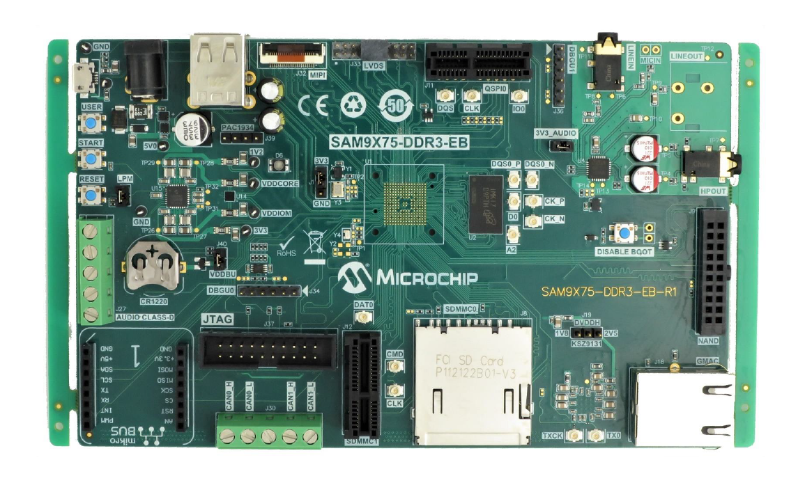

# HID Basic Mouse USART Example \(hid\_basic\_mouse\_usart\)

This application demonstrates the use of the USB HID Host Client Driver to enumerate and  operate a HID USB Mouse device.

## **Description**

This application uses the USB Host layer, HID Client driver and HID Mouse Usage driver to  enumerate a USB Mouse and detect Mouse button press release events. The Mouse events are  displayed using a terminal emulator on a personal computer.

## **Downloading and building the application**

To clone or download this application from Github, go to the [main page of this repository](https://github.com/Microchip-MPLAB-Harmony/usb_apps_host) and then click **Clone** button to  clone this repository or download as zip file. This content can also be downloaded using  content manager by following these [instructions](https://github.com/Microchip-MPLAB-Harmony/contentmanager/wiki).

Path of the application within the repository is [usb\_apps\_host/apps/hid\_basic\_mouse\_usart](https://github.com/Microchip-MPLAB-Harmony/usb_apps_host/tree/master/apps/hid_basic_mouse_usart).

Following table gives the details of project configurations, target device used,  hardware and its IDE. Open the project using the respective IDE and build it.

|Project Name|IDE|Target Device|Hardware / Configuration|
|------------|---|-------------|------------------------|
|pic32mz\_ef\_curiosity\_2\_0.X|MPLABX|PIC32MZ2048EFM144|Curiosity PIC32MZ EF 2.0 Development Board|
|sam\_9x60\_ek.X|MPLABX|SAM9X60|SAM9X60-EK Evaluation Board|
|sam\_9x60\_ek\_freertos.X|MPLABX|SAM9X60|SAM9X60-EK Evaluation Board|
|sam\_9x60\_curiosity.X|MPLABX|SAM9X60|SAM9X60 Curiosity Development Board|
|sam\_9x60\_curiosity\_freertos.X|MPLABX|SAM9X60|SAM9X60 Curiosity Development Board|
|sam\_9x75\_eb.X|MPLABX|SAM9X75|SAM9X75-DDR3-EB Evaluation Board|
|sam\_a5d2\_xult.X|MPLABX|ATSAMA5D27C|SAM A5D2 Xplained Ultra Board|
|sam\_a5d2\_xult\_freertos.X|MPLABX|ATSAMA5D27C|SAMA5D2 Xplained Ultra Board|
|sam\_a5d27\_som1\_ek.X|MPLABX|ATSAMA5D27C|SAMA5D27 SOM1 Kit1|
|sam\_a5d27\_som1\_ek\_freertos.X|MPLABX|ATSAMA5D27C|SAMA5D27 SOM1 Kit1|
|sam\_a5d27\_wlsom1\_ek1.X|MPLABX|ATSAMA5D27C|ATSAMA5D27 WLSOM1 EK1|
|sam\_a5d27\_wlsom1\_ek1\_freertos.X|MPLABX|ATSAMA5D27C|ATSAMA5D27 WLSOM1 EK1|
|sam\_a7g5\_ek.X|MPLABX|SAMA7G54|SAMA7G5 EK Board|
|sam\_d21\_xpro.X|MPLABX|ATSAMD21J18A|SAMD21 Xplained Pro Board|
|sam\_e54\_xpro.X|MPLABX|ATSAME54P20A|SAME54 Xplained Pro Board|
|sam\_e70\_xult.X|MPLABX|ATSAME70Q21B|SAME70 Xplained Ultra Board|
|sam\_e70\_xult\_freertos.X|MPLABX|ATSAME70Q21B|SAME70 Xplained Ultra Board|
|sam\_g55\_xpro.X|MPLABX|ATSAMG55J19|SAMG55 Xplained Pro Board|
|pic32cz\_ca80\_curiosity\_ultra.X|MPLABX|PIC32CZ8110CA80208|PIC32CZ Curiosity Development Board|
|pic32ck\_gc01\_curiosity\_ultra.X|MPLABX|PIC32CK2051GC01144|PIC32CK GC Curiosity Ultra Development Board|
|pic32cx\_sg41\_curiosity\_ultra.X|MPLABX|PIC32CX1025SG41128|PIC32CX SG41 Curiosity Ultra Evaluation Board|
|sam\_a5d29\_curiosity.X|MPLABX|ATSAMA5D29|SAMA5D29 Curiosity Development Board|
|sam\_9x75\_curiosity.X|MPLABX|SAM9X75D2G|SAM9X75-Curiosity Development Board|

## **Configuring the Hardware**

[**PIC32CZ CA80 Curiosity Development Board**](https://www.microchip.com/en-us/development-tool/ea61x20a)

-   A commercially available USB Mouse is required to run this demonstration application.
-   Connect the USB Mouse to the connector \(J102\) using a USB Type-A Female to micro-B male cable \(This cable is not included in the kit\).
-   LED0 indicates a Device Connection \(Attached device has been successfully enumerated and configured\). This LED is also toggled on the Mouse Button press event.
-   The demonstration uses the PKOB4 Serial Interface to transfer messages on a PC.

[**PIC32CX SG41 Curiosity Ultra Evaluation Board**](https://www.microchip.com/en-us/development-tool/EV06X38A)

-   A commercially available USB Mouse is required to run this demonstration application.
-   Connect the USB Mouse to the connector \(J200\) using a USB Type-A Female to micro-B male cable \(This cable is not included in the kit\).
-   LED2 indicates a Device Connection \(Attached device has been successfully enumerated and configured\). This LED is also toggled on the Mouse Button press event.
-   The demonstration uses the PKOB4 Serial Interface to transfer messages on a PC.

[**PIC32CK GC Curiosity Ultra Development Board**](https://www.microchip.com/en-us/development-tool/ea23j82a)

-   An external power supply \(6.5V to 14V\) must be connected through the J200 connector.
-   A commercially available USB Mouse is required to run this demonstration application.
-   Connect the USB Mouse to the USB Type-C connector \(J202\). A USB Type-C to Type-A Female adapter is required to connect the USB device to the board \(This adapter is not included in the kit\).
-   LED1 indicates a Device Connection \(Attached device has been successfully enumerated and configured\). This LED is also toggled on the Mouse Button press event.
-   The demonstration uses the PKOB4 Serial Interface to transfer messages on a PC.

**[Curiosity PIC32MZ EF 2.0 Development Board](https://www.microchip.com/Developmenttools/ProductDetails/DM320209)**

-   A commercially available USB Mouse is required to run this demonstration  application.

-   Connect the USB Mouse to the "TARGET USB" connector \(J201\) using a USB  Type-A Female to micro-B male cable \(This cable is not included in the kit\).

-   LED1 indicates a Device Connection \(Attached device has been successfully  enumerated and configured\). This LED is also toggled on the Mouse Button press  event.

-   The demonstration uses the PKOB4 Serial Interface to transfer messages on a  PC.

**[SAMD21 Xplained Pro Board](https://www.microchip.com/developmenttools/ProductDetails/atsamd21-xpro)**

-   A commercially available USB Mouse is required to run this demonstration application.
-   Jumper titled "PA03 SELECT" must be shorted between PA03 and USB\_ID\(positions 2 and 3\)
-   Use "TARGET USB" connector on the board to connect the USB Mouse to the USB Host. A USB micro AB to type A USB Host receptacle converter will be needed to connect the device.
-   LED0 indicates a Device Connection. \(Attached device has been successfully enumerated and configured\). This LED is also toggled on Mouse Button press event.
-   The demonstration uses the EDBG Serial Interface to transfer demonstration application messages on a PC.

    **Note:** Note: An unexpected behavior may be observed if the attached USB  device draws an excess amount of current from the board and the Vdd voltage drops  below 2.7 volts. The demo has the wait states \(NVM\_CTRLB <RWS\[3:0\]\>\) value set  to '1'.

**[SAME54 Xplained Pro Board](https://www.microchip.com/developmenttools/productdetails/atsame54-xpro)**

-   A commercially available USB Mouse is required to run this demonstration application.
-   Use "TARGET USB" connector on the board to connect the USB Mouse to the USB Host. A USB micro AB to type A USB Host receptacle converter will be needed to connect the device.
-   LED0 indicates a Device Connection. \(Attached device has been successfully enumerated and configured\). This LED is also toggled on Mouse Button press event.
-   The demonstration uses the EDBG Serial Interface to transfer demonstration application messages on a PC.

**[SAME70 Xplained Ultra Board](https://www.microchip.com/DevelopmentTools/ProductDetails/PartNO/DM320113)**

-   A commercially available USB Mouse is required to run this demonstration application.
-   Jumper J203 must be shorted between PB08 and LED2\(positions 1 and 2\).
-   Use "TARGET USB" J200 connector on the board to connect the USB Mouse to the USB Host. A USB micro AB to type A USB Host receptacle converter will be needed to connect the device.
-   LED3 indicates a Device Connection. \(Attached device has been successfully enumerated and configured\). This LED is also toggled on Mouse Button press event.
-   The demonstration uses the EDBG Serial Interface to transfer demonstration application messages on a PC.

**[SAMG55 Xplained Pro Board](https://www.microchip.com/DevelopmentTools/ProductDetails/PartNO/ATSAMG55-XPRO)**

-   A commercially available USB Mouse is required to run this demonstration application.
-   Chip Erase Jumper must be open.
-   Use TARGET USB connector on the board to connect the USB Mouse to the USB Host. A USB micro AB to type A USB Host receptacle converter will be needed to connect the device.
-   LED0 indicates a Device Connection. \(Attached device has been successfully enumerated and configured\). This LED is also toggled on Mouse Button press event.
-   The demonstration uses the EDBG Serial Interface to transfer demonstration application messages on a PC.

**[SAM9X60-EK Evaluation Board](https://www.microchip.com/developmenttools/ProductDetails/DT100126)**

-   A commercially available USB Mouse is required to run this demonstration  application.

-   Setup the SD card \(Note: exFAT formatted SD Cards are not supported\)

    -   Download harmony MPU bootstrap loader from this [location](https://github.com/Microchip-MPLAB-Harmony/usb_apps_host/tree/master/deps/at91bootstrap_sam_9x60_binaries/boot.bin).
    -   Copy the downloaded boot loader binary \(boot.bin\) and generated application binary \(harmony.bin\) into the SD card.
    -   Insert the SD card into the SDMMC connector J4 on the board.
    -   Reset the board by pressing the Push Button SW3.
-   Jumpers J20, J21, and J13 must be open.

-   Jumper J2 and J3 must be shorted.

-   Connect the USB Micro-B port \(J22\) on board to the computer using a micro  USB cable \(to enable debug com port\).

-   Connect the USB Micro-B Connector \(J7\) on the board to the computer using a  micro USB cable to power up the board.

-   Connect the USB Mouse to the Type-A connector \(J8\).

-   LED D1 indicates a Device Connection Attached device has been successfully  enumerated and configured\). This LED is also toggled on the Mouse Button press  event.

-   The demonstration uses the USB Micro-B port \(J22\) to transfer demonstration  application messages on a PC.

    Note: Reset push button on SAM9X60 EK is labelled as SW3

**[SAM9X60-Curiosity Board](https://www.microchip.com/en-us/development-tool/EV40E67A)**

-   Setup the SD card \(Note: exFAT formatted SD Cards are not supported\)

    -   Download harmony MPU bootstrap loader from this [location](https://github.com/Microchip-MPLAB-Harmony/usb_apps_host/tree/master/deps/at91bootstrap_sam_9x60_binaries/boot.bin).
    -   Copy the downloaded boot loader binary \(boot.bin\) and generated application binary \(harmony.bin\) into the SD card.
    -   Insert the SD card into the SDMMC0 connector J3 on the board.
    -   Reset the board by pressing the Push Button RESET.
-   Jumper J4 must be shorted.

-   Connect the USB Micro-B Connector \(J1\) on the board to the computer using a  micro USB cable.

-   Connect the USB device to the Type-A connector \(J10\).

-   LED D1 indicates a Device Connection Attached device has been successfully  enumerated and configured\). This LED is also toggled on the Mouse Button press  event.

-   The demonstration uses an USB to serial cable to transfer demonstration  application messages on a PC.

    

**[SAM9X75-DDR3-EB Evaluation Board](https://file+.vscode-resource.vscode-cdn.net/c%3A/H3_USB_APPS/usb_apps_host/apps/hid_basic_mouse_usart/readme.md)**

-   A commercially available USB Mouse is required to run this demonstration  application.

-   Powered the board with an external power supply \(or use the micro AB  connector\).

-   Setup the SD card \(Note: exFAT formatted SD Cards are not supported\)

    -   Download harmony MPU bootstrap loader from this [location](https://github.com/Microchip-MPLAB-Harmony/usb_apps_host/tree/master/deps/at91bootstrap_sam_9x7_binaries/boot.bin).
    -   Copy the downloaded boot loader binary \(boot.bin\) and generated application binary \(harmony.bin\) into the SD card.
    -   Insert the SD card into the SDMMC connector \(SDMMC0\) on the board.
    -   Reset the board by pressing the Push Button RESET, then START.
-   Connect an USB to serial cable to DBGU0 \(to enable debug com port\).

-   Connect the USB device to the Type-A connector or to the micro AB with a  specific dongle \(in these case the need to be powered by the external power supply\).

-   LED near VDDCORE inscription on the board indicates a Device Connection  Attached device has been successfully enumerated and configured\). This LED is also  toggled on the Mouse Button press event.

-   The demonstration  uses an USB to serial cable to transfer demonstration application messages on a  PC.

    **[SAMA5D2 Xplained Ultra Board](https://www.microchip.com/Developmenttools/ProductDetails/ATSAMA5D2C-XULT)**

    -   A commercially available USB Mouse is required to run this demonstration application.
    -   Setup the SD card \(Note: exFAT formatted SD Cards are not supported\)
        -   Download harmony MPU bootstrap loader from this [location](https://github.com/Microchip-MPLAB-Harmony/usb_apps_host/tree/master/deps/at91bootstrap_sam_a5d2_binaries/boot.bin).
        -   Copy the downloaded boot loader binary \(boot.bin\) and generated application binary \(harmony.bin\) into the SD card.
        -   Insert the SD card into the SDMMC1 slot on the board.
        -   Reset the board by pressing the Push Button BP3.
    -   Connect the EDBG USB Micro-B port J14 on the board to the computer using a micro USB cable.
    -   Connect the USB Mouse to the USB Type-A connector "A5-USB-B" \(J13\).
    -   RGB LED indicates a Device Connection \(Attached device has been successfully enumerated and configured\). This LED is also toggled on the Mouse Button press event.
    -   The demonstration uses the EDBG USB Micro-B port J14 to transfer demonstration application messages on a PC.
    **[SAMA5D27 SOM1 Kit1](https://www.microchip.com/developmenttools/ProductDetails/atsama5d27-som1-ek1)**

    -   A commercially available USB Mouse is required to run this demonstration application.
    -   Setup the SD card \(Note: exFAT formatted SD Cards are not supported\)
        -   Jumper J9 must be removed to have the JTAG-CDC enable.
        -   Download harmony MPU bootstrap loader from this [location](https://github.com/Microchip-MPLAB-Harmony/usb_apps_host/tree/master/deps/at91bootstrap_sam_a5d27_som1_binaries/boot.bin).
        -   Copy the downloaded boot loader binary \(boot.bin\) and generated application binary \(harmony.bin\) into the SD card.
        -   Insert the SD card into the SDMMC0 slot \(J12\) on the board.
        -   Reset the board by pressing the Push Button PB1.
    -   Connect the USB Micro-AB port \(J10\) on the board to the computer using a micro USB cable.
    -   Connect the USB Mouse to the USB-B Type-C connector \(J19\) on the board.
    -   RGB LED indicates a Device Connection \(Attached device has been successfully enumerated and configured\). This LED is also toggled on the Mouse Button press event.
    -   The demonstration uses the USB Micro-AB port \(J10\) to transfer demonstration application messages on a PC.

**[ATSAMA5D27-WLSOM1 Evaluation Kit](https://www.microchip.com/DevelopmentTools/ProductDetails/PartNO/DM320117)**

-   A commercially available USB Mouse is required to run this demonstration application.
-   Setup the SD card \(Note: exFAT formatted SD Cards are not supported\)
    -   Download harmony MPU bootstrap loader from this [location](https://github.com/Microchip-MPLAB-Harmony/usb_apps_host/tree/master/deps/at91bootstrap_sam_a5d27_wlsom1_binaries/boot.bin).
    -   Copy the downloaded boot loader binary \(boot.bin\) and generated application binary \(harmony.bin\) into the SD card.
    -   Insert the SD card into the SDMMC0 Card Connector \(J9\) on the board.
    -   Reset the board by pressing the Reset Button \(SW2\)
-   Connect the USB-A Micro-AB connector \(J10\) on the board to the computer using a micro USB cable.
-   Press the "START\_SOM" button to activate board start-up.
-   Connect the USB Mouse to the USB Type-A connector \(J11\) on the board.
-   RGB LED indicates a Device Connection \(Attached device has been successfully enumerated and configured\). This LED is also toggled on the Mouse Button press event.
-   The demonstration uses the Debug UART port \(J26\) to transfer demonstration application messages on a PC. A USB/Serial converter is required to connect the J26 to a PC \(The USB/Serial converter is not included in the kit\).

**[SAMA5D29 Curiosity Development Board](https://www.microchip.com/en-us/development-tool/ev07r15a)**

-   Setup the SD card \(Note: exFAT formatted SD Cards are not supported\)
    -   Download harmony MPU bootstrap loader from this [location](https://github.com/Microchip-MPLAB-Harmony/usb_apps_host/tree/master/deps/at91bootstrap_sam_a5d29_binaries/boot.bin).
    -   Copy the downloaded boot loader binary \(boot.bin\) and generated application binary \(harmony.bin\) into the SD card.
    -   Insert the SD card into the μSD-CARD connector J6 on the board.\(This connector is present on the bottom face of the board\)
    -   Reset the board by pressing the Push Button RESET.
-   Press the "START" button to activate board start-up.
-   Connect the USB device to the USB\_B Type-A connector \(J11\) on the board.
-   RGB LED \(D5\) on the board indicates a Device Connection \(Attached device has been successfully enumerated and configured\). This LED is also toggled on the Mouse Button press event.
-   The demonstration uses the UART DEBUG port \(J28\) to transfer demonstration application messages on a PC. A USB/Serial converter is required to connect the J28 to a PC \(The USB/Serial converter is not included in the kit\).

**SAM9X75-Curiosity Development Board**

-   Setup the SD card \(Note: exFAT formatted SD Cards are not supported\)
    -   Download harmony MPU bootstrap loader from this [location](https://github.com/Microchip-MPLAB-Harmony/usb_apps_host/tree/master/deps/at91bootstrap_sam_9x75_curiosity_binaries/boot.bin).
    -   Copy the downloaded boot loader binary \(boot.bin\) and generated application binary \(harmony.bin\) into the SD card.
    -   Insert the SD card into the μSD-CARD connector \(J14\) on the board.\(This connector is present on the bottom face of the board\)
    -   Reset the board by pressing the Push Button RESET.
-   Press the "START" button to activate board start-up.
-   Connect the USB device to the USB\_B Type-A connector \(J15\) or USB\_C Type-A connector \(J16\) on the board.
-   RGB LED \(LD1\) on the board indicates a Device Connection \(Attached device has been successfully enumerated and configured\). This LED is also toggled on the Mouse Button press event.
-   The demonstration uses the UART DEBUG port \(J35\) to transfer demonstration application messages on a PC. A USB/Serial converter is required to connect the J35 to a PC \(The USB/Serial converter is not included in the kit\).

## **Running the Application**

 

1.  Open the project with appropriate IDE. Compile the project and program the  target device.

2.  Launch a terminal emulator, such as Tera Term. Select the appropriate COM  port and set the serial port settings to 115200-N-1.

3.  If a USB mouse is not connected to the Host connector, the serial terminal  emulator window will show the "Connect Mouse" prompt.

4.  Attach a USB mouse to the Host connector of the target hardware. Refer to  the Configuring the Hardware section for any converter requirements. The message,  "Mouse Connected", will display in the serial terminal emulator window.

5.  Begin moving the mouse and the appropriate relative coordinate changes for  X,Y, and Z axes should be displayed in the serial terminal window.

6.  Click the mouse button to toggle LEDs on the board. Refer to the  Configuring the Hardware section for details on the relevant LED.

7.  Disconnecting the mouse will result in the message, "Connect Mouse", to  reappear on the serial console.

    

 

**Parent topic:**[Harmony 3 USB Host application examples](GUID-4BEB4580-5653-4314-ABDE-36EF2BAAF53B.md)

